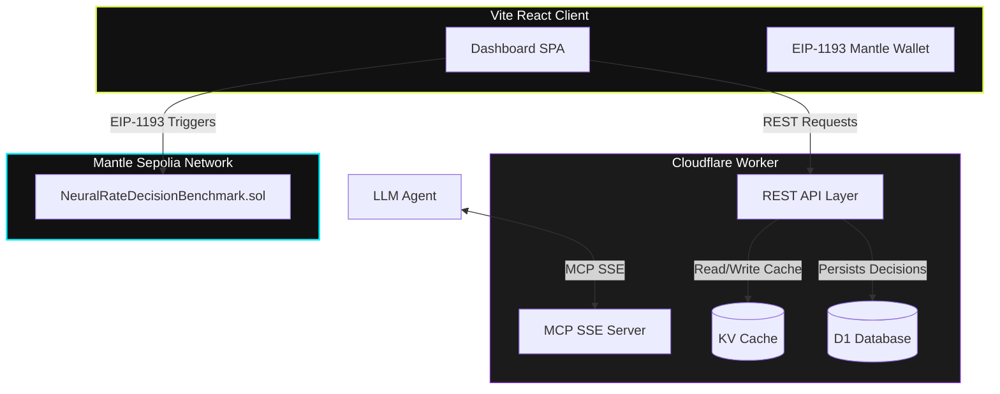

# NeuralRate MCP — Yield Optimization Hub on Mantle

NeuralRate MCP is an autonomous yield intelligence agent and high-performance DeFi dashboard designed for the **Mantle Network**. 

It leverages real-time yields data, macroeconomic indicators, and institutional orderflow signals to assess risk deterministically using a **6-factor Risk Assessment Model** and calculate optimal allocations. Built for AI-agent interoperability, NeuralRate exposes its capabilities directly to Large Language Models (LLMs) via the **Model Context Protocol (MCP)**, and logs decisions immutably on-chain using a dedicated Solidity benchmark contract.



---

## 📂 Repository Layout

The project is structured as a monorepo containing the following components:

* **`/apps/worker`**: The Cloudflare Worker backend. Exposes a CORS-enabled REST API for the web dashboard and runs the stateful Model Context Protocol (MCP) server over Server-Sent Events (SSE). Integrates Cloudflare KV caching and D1 SQLite storage.
* **`/apps/web`**: The Vite React frontend dashboard, featuring dark glassmorphism styling, custom OKLCH colors, 8px rounded corners, and native EIP-1193 Web3 provider integration for the Mantle Sepolia network.
* **`/contracts`**: The Hardhat development workspace containing `NeuralRateDecisionBenchmark.sol`, a Solidity-based registry contract deployed on Mantle Sepolia to record decisions and audit prediction accuracy.
* **`/docs`**: Comprehensive, zero-speculation technical documentation of the entire platform:
  1. [System Architecture Guide](docs/architecture.md) — Structural layout, data flow, and caching strategy.
  2. [MCP Server Specifications](docs/mcp-server.md) — 7 tools definitions and the complete formulas for the 6-factor Risk Model.
  3. [Smart Contract Documentation](docs/smart-contract.md) — Functions, modifiers, variables, and events.
  4. [Frontend UI Reference](docs/frontend.md) — Component architecture, EIP-1193 Mantle Sepolia hook, and glassmorphism styling.
  5. [Database Schema](docs/database.md) — SQLite Cloudflare D1 schema columns and tables representation.

---

## ⚡ Quick Start (Local Development)

To run the full workspace locally, launch the backend and frontend services simultaneously:

### 1. Prerequisite Variables
Ensure you have a `.env` file in the root workspace configured with the required third-party API credentials:
```env
FRED_API_KEY="your_fred_api_key"
NANSEN_API_KEY="your_nansen_api_key"
```

### 2. Run the Cloudflare Worker Backend
Navigate to the worker directory, install dependencies, and start Wrangler's local development server:
```bash
cd apps/worker
npm install
npx wrangler dev
```
* The backend will boot at `http://localhost:8787` (CORS headers enabled for local frontend requests).
* Exposes REST endpoints under `/api/*` and the stateful SSE agent connection stream at `/mcp`.

### 3. Run the Vite React Frontend
In a new terminal window, navigate to the web app directory, install dependencies, and launch Vite's HMR dev server:
```bash
cd apps/web
npm install
npm run dev
```
* The frontend dashboard will open at `http://localhost:5173`.
* Standardizes to Mantle Sepolia (Chain ID `5003`).

---

## 🛡️ Core Features Deployed

1. **6-Factor Deterministic Risk Engine:** Evaluates protocols based on TVL, Volume utilization (detecting lending pools automatically), APY sustainability, Yield Composition (base vs reward incentives), IL risk, and Nansen Smart Money flows.
2. **EIP-1193 Mantle Sepolia Bridge:** Zero-dependency native Web3 connection supporting auto chain switching and disconnect transitions.
3. **Decisions Logging (D1 DBLayer + EVM contract):** The D1 SQLite database acts as a localized transaction register, audited and referenced directly by the `createDecision` and `settleDecision` solidity operations on-chain.
4. **Agent-Access MCP Portal:** Connects AI agents directly to our DeFi tools in 1-click using SSE and standard JSON configurations.
