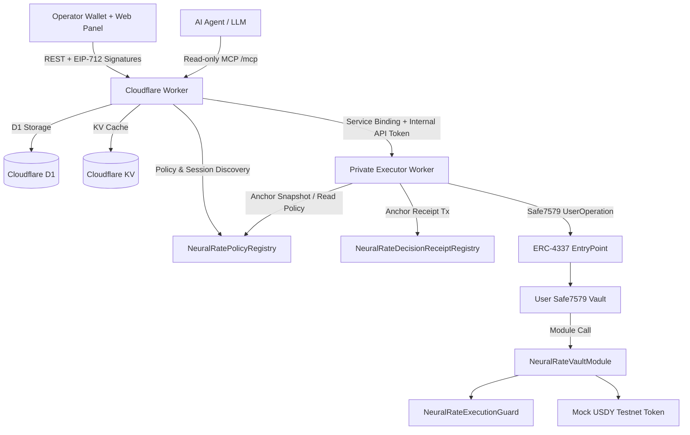

# NeuralRate MCP

[](https://opensource.org/licenses/MIT)
[-5c6bc0.svg)](https://explorer.sepolia.mantle.xyz)

NeuralRate MCP is a decentralized yield optimization and risk assessment terminal deployed on **Mantle Sepolia (`5003`)**. It enables AI agents and operator panels to securely scan yields, assess protocol risk, benchmark allocation decisions, and dispatch automated vault execution transactions within owner-defined, on-chain policy limits.

The project features a **Cloudflare Worker public control plane**, a **private Cloudflare Worker executor for transaction dispatch**, a **Vite React operator panel**, and a suite of **Solidity smart contracts** acting as the ultimate execution guards.

---

## Key Features & Capabilities

1. **Deterministic Multi-Factor Risk Engine**: A deterministic scoring system evaluating TVL depth, volume utilization, APY volatility, yield composition (base vs. rewards), IL exposure, and institutional flow metrics to classify pool risk (Low, Medium, High, Critical).
2. **Public Model Context Protocol (MCP) Server**: A read-only MCP catalog allowing LLMs to scan Mantle yields, check T-Bill spreads, retrieve token context, and request optimal asset allocations.
3. **Session-Scoped Mutation Catalogs**: Scoped mutation routes (`/mcp/scoped/config`, `/mcp/scoped/benchmark`, `/mcp/scoped/execution`) that expose sensitive tools only to authorized agents holding a valid, owner-signed session token.
4. **On-Chain Policy Enforcement**: Decentralized verification where all automation boundaries (spend caps, allowlisted assets, selectors, delegates, validity windows) are stored directly in `NeuralRatePolicyRegistry.sol` and enforced by `NeuralRateExecutionGuard.sol`.
5. **On-Chain Decision Receipts**: Immutable logging of yield-allocation decisions to `NeuralRateDecisionReceiptRegistry.sol` with cryptographic data snapshots for third-party auditability and performance settlement.
6. **Real Safe7579 Vault Execution**: Automated execution is dispatched from the user's Safe vault through the Safe7579/ERC-4337 runtime and `NeuralRateVaultModule.sol`, validating delegate authority and intent limits on-chain before transaction dispatch.
7. **Mock USDY Testnet Harness**: Mantle Sepolia exposes an explicit `mock-usdy-sepolia-allocation` path for ERC-20 demo execution because Ondo has no canonical public USDY deployment on this testnet.

---

## System Architecture & Topology



### Component Breakdown

*   **`apps/worker` (Public Control Plane)**: Exposes public REST endpoints and the MCP server. Resolves market data (DefiLlama, FRED API, Nansen), manages user/vault records in D1, handles EIP-712 nonce authentication, manages short-lived MCP sessions, and queues jobs to the executor.
*   **`apps/executor` (Internal Dispatcher)**: A private Cloudflare Worker that receives authorized jobs from the public Worker through service binding, checks strategy parameters, anchors data snapshots to the policy registry, and dispatches on-chain transactions (decision receipts and Safe7579 vault calls) using Turnkey-managed keys, paymaster-backed AA, and the delegate validator.
*   **`apps/web` (Vite React Operator Panel)**: React application providing wallet connection (via Privy), dedicated Safe vault bootstrapping, policy publication/revocation directly on-chain, and an operator panel to view historical allocations, jobs, and telemetry.
*   **`contracts` (Solidity Framework)**: Deployed contract workspace providing the secure foundation for policy validation, benchmark receipt logging, and Safe module execution guards.

---

## Smart Contract Registry (Mantle Sepolia)

All production contracts are deployed on Mantle Sepolia (`5003`):

| Contract | Role / Purpose | Deployed Address |
| :--- | :--- | :--- |
| **`NeuralRateDecisionReceiptRegistry`** | Immutable decision receipt registry for benchmarking | [`0xC0C836A220D006398cdE4D5caf529196E63f81A8`](https://sepolia.mantlescan.xyz/address/0xC0C836A220D006398cdE4D5caf529196E63f81A8) |
| **`NeuralRatePolicyRegistry`** | Anchors owner policy parameters & snapshot references | [`0x86cD4f8c2528E71a473ED342aa73B8a00de906a4`](https://sepolia.mantlescan.xyz/address/0x86cD4f8c2528E71a473ED342aa73B8a00de906a4) |
| **`NeuralRateExecutionGuard`** | On-chain guard validating vault transaction limits | [`0x666Bc822156824F40F2b70aAaAcBfe87467D79A5`](https://sepolia.mantlescan.xyz/address/0x666Bc822156824F40F2b70aAaAcBfe87467D79A5) |
| **`NeuralRateVaultModule`** | Safe Module executing automated transactions | [`0xf7061501a464e893636a5BF8eB4ab7Ba2819154D`](https://sepolia.mantlescan.xyz/address/0xf7061501a464e893636a5BF8eB4ab7Ba2819154D) |
| **`NeuralRateDelegateValidator`** | Safe7579 delegate validator for ERC-4337 UserOperations | [`0x0A03F7763d53757183aD86C393eEfF6D8177e4cE`](https://sepolia.mantlescan.xyz/address/0x0A03F7763d53757183aD86C393eEfF6D8177e4cE) |
| **`NeuralRateUsdYStrategyAdapter`** | Preserved strategy adapter for USDY allocation | [`0xFeE16FAd13789e9bBA4779D025186341e58799a3`](https://sepolia.mantlescan.xyz/address/0xFeE16FAd13789e9bBA4779D025186341e58799a3) |
| **`MockERC20` as Mock USDY** | Testnet-only USDY-shaped ERC-20 demo token | [`0xC63FB10deD215c6De6cDB438FB2Ce7944F6Af5bE`](https://sepolia.mantlescan.xyz/address/0xC63FB10deD215c6De6cDB438FB2Ce7944F6Af5bE) |

---

## Strategy Truth & Execution Scope

NeuralRate supports three execution targets under testnet demo profiles:

1.  **`mock-usdy-sepolia-allocation` (Current USDY Demo Harness)**
    *   **Asset**: Mock USDY ERC-20 on Mantle Sepolia.
    *   **Mechanism**: Moves Safe-held Mock USDY through the same Safe module ERC-20 routing path used by governed execution.
    *   **Funding**: Use the Vault UI Mock USDY Faucet or MCP `prepare_mock_usdy_mint` to mint testnet balance to the Safe vault, not the user's EOA.
    *   **Live proof**: Confirmed on 2026-06-12 with tx [`0x36281947f5fb3088c29e6926979f150eb10ee03e5be86e4973599bf8823409b6`](https://sepolia.mantlescan.xyz/tx/0x36281947f5fb3088c29e6926979f150eb10ee03e5be86e4973599bf8823409b6), moving `1 USDY` from the Safe vault through ERC-4337 EntryPoint execution.
    *   **Disclosure**: USDY is mocked on Mantle Sepolia because Ondo has no canonical public testnet USDY deployment; mainnet integration uses Ondo's canonical USDY contract.
2.  **`mnt-native-transfer` (Supported Native Demo Target)**
    *   **Asset**: Native `MNT`
    *   **Mechanism**: A real transfer transaction executed from the user's Safe vault via `NeuralRateVaultModule.sol` to an allowlisted destination.
    *   **Enforcement**: Fully verified against the active on-chain policy and execution guard.
3.  **`usdy-stable-allocation` (Preserved Canonical Target)**
    *   **Asset**: Ondo USDY Stablecoin
    *   **Mechanism**: Intended to swap stablecoins for USDY yields.
    *   **Sepolia Behavior**: Blocked with an explicit reason when no canonical venue is configured on testnet.

---

## Model Context Protocol (MCP) Surface

The Worker advertises the canonical read-only MCP endpoint in [agent-card.json](agent-card.json) at:
`https://neuralrate-worker.neuralrate.workers.dev/mcp`

### Tool Directory

#### Public Read-Only Tools (Advisory)
*   `yield_scan`: Scans Mantle DeFi pools for current APY and TVL via DefiLlama.
*   `tbill_spread`: Calculates the spread (in bps) between a DeFi pool APY and the real-time US 3-Month T-Bill rate.
*   `nansen_context`: Fetches Smart Money flows for a specific token via Nansen API.
*   `risk_assess`: Performs a deterministic 6-factor risk assessment.
*   `optimal_allocation`: Computes an optimal allocation based on the user's risk profile and constraints.
*   `get_decisions`: Fetches logged decisions from the database.

#### Session-Locked Mutation Tools (Requires Authorization)
*   `get_user_state` / `list_jobs`: Retrieves active configuration, session and background job logs (requires `sessionToken`).
*   `update_agent_policy` (Config Scope): Modifies the owner's off-chain configuration limits (requires config domain session).
*   `queue_benchmark` (Benchmark Scope): Submits a transaction to anchor a decision receipt on-chain.
*   `prepare_mock_usdy_mint` (Execution Scope): Prepares a wallet-signable Mock USDY mint transaction for the agent Safe vault.
*   `execute_strategy` and governed strategy helpers (Execution Scope): Dispatch automated strategy calls through the user's Safe7579 vault and Safe module.

---

## Local Development Setup

To run the entire NeuralRate monorepo locally, follow these steps:

### 1. Configure Environments
Copy the environment template files and insert your API keys and signer secrets:
```bash
# Root environment parameters (for preflight check and deployment sync)
cp .env.example .env

# Worker environment configuration
cp apps/worker/.dev.vars.example apps/worker/.dev.vars

# Executor environment configuration
cp apps/executor/.env.example apps/executor/.env.local

# Web application configuration
cp apps/web/.env.example apps/web/.env
```

### 2. Boot Services
Run the following commands in separate terminal sessions:

```bash
# Terminal 1: Start Worker (REST API + Local D1 Database)
cd apps/worker
npm install
npx wrangler dev

# Terminal 2: Start Executor (Transaction Dispatcher)
cd apps/executor
npm install
npm run dev

# Optional: emulate the private Cloudflare Worker runtime locally
cd apps/executor
npm run dev:worker

# Terminal 3: Start Web Operator App
cd apps/web
npm install
npm run dev
```

---

## Release & Deployment Workflow

### 1. Synchronization and Verification Preflight
Before committing or submitting a PR, make sure your build configurations are synchronized with the deployment contracts. Run the following preflight suite at the root directory:

```bash
# 1. Sync deploy manifests with wrangler.toml and env examples
npm run sync:deployments

# 2. Perform public environment integrity checks
npm run preflight:public

# 3. Verify minimum local configuration requirements
npm run preflight:release
```

*   `npm run sync:deployments`: Automates copying canonical Mantle Sepolia deployment addresses from `deployments/*.json` into worker configurations (`wrangler.toml`), `.dev.vars`, and public `.env` files.
*   `npm run preflight:release`: Validates local configuration parameters (Turnkey secrets, bundler URLs, smart contract addresses) to ensure local environments are deployment-ready.

### 2. Continuous Deployment Model
NeuralRate uses a mixed deployment model:
*   **Web Panel**: Deployed automatically via Cloudflare Pages on push events to connected branches.
*   **Worker**: Published via local Wrangler CLI using repository scripts.
*   **Executor**: Published as a private Cloudflare Worker via local Wrangler CLI using repository scripts.

Canonical production commands:

```bash
npm run cf:executor:secrets:sync
npm run cf:worker:secrets:sync
npm run cf:prod:publish
```

*Note: Production credentials and API keys (`NANSEN_API_KEY`, `FRED_API_KEY`, `NEURALRATE_INTERNAL_API_TOKEN`, Turnkey keys, Pimlico key) must be configured through Cloudflare Worker secrets, not committed to repository files.*

---

## Documentation Index

For detailed guides, please refer to the files in the `docs` folder:

*   [docs/architecture.md](docs/architecture.md) — Topology, service boundaries, data flows, and trust limits.
*   [docs/smart-contract.md](docs/smart-contract.md) — Hardhat workspace, inventory, and logic of smart contracts.
*   [docs/mcp-server.md](docs/mcp-server.md) — Public and scoped mutation MCP endpoints and tool catalog rules.
*   [docs/database.md](docs/database.md) — Cloudflare D1 schema migrations, indexes, and tables structure.
*   [docs/risk-model.md](docs/risk-model.md) — Scoring formulas, weights, and depeg parameters of the risk engine.
*   [docs/frontend.md](docs/frontend.md) — App states, Privy integration, and Safe actions.
*   [docs/data-lineage.md](docs/data-lineage.md) — Snapshot layout and retrieval APIs for audit verification.
*   [docs/trust-assumptions.md](docs/trust-assumptions.md) — Decentralized vs. centralized validation assumptions and residual risks.
*   [docs/deployment.md](docs/deployment.md) — CI/CD setups, Wrangler scripts, and platform boundaries.
*   [docs/README.md](docs/README.md) — Documentation index mapping and status.
