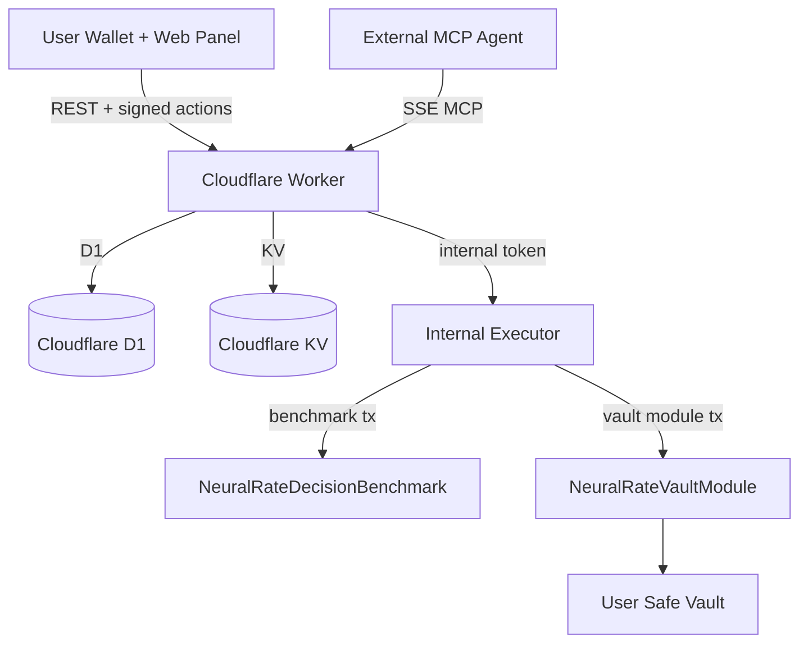

# NeuralRate MCP

**Status:** Canonical doc

NeuralRate MCP is a Mantle Sepolia (`5003`) project with three public-facing outcomes implemented in code:

- a Cloudflare Worker that exposes analytics and mutation-capable MCP tools
- a web panel that lets a user inspect state and sign manual actions
- an internal executor that writes benchmark transactions and dispatches vault-scoped execution jobs

The current live Sepolia execution demo is a real native `MNT` transfer routed through a pinned Safe module. The preserved `usdy-stable-allocation` path is intentionally blocked on Sepolia unless a canonical venue is configured.

## Current Product Shape

- **Worker is the public control plane.**
  It serves the MCP endpoint and the REST API used by the web app.
- **Executor is internal.**
  The browser should not call it directly. The worker forwards validated jobs to it with an internal token.
- **Web is an operator/user panel.**
  It bootstraps a user vault, displays policies, asks for wallet signatures, and shows grants, sessions, jobs, and benchmark history.
- **On-chain benchmarking is real.**
  Benchmark writes go to `NeuralRateDecisionBenchmark.sol` on Mantle Sepolia.
- **Vault execution is real.**
  The `NeuralRateVaultModule` executes real calls from the user Safe once automation has been granted and enabled.

## Repository Layout

- `apps/worker`
  Public worker. Hosts the REST API, MCP server, auth nonce flow, grant/session flow, and D1/KV-backed state.
- `apps/executor`
  Internal job runner. Validates execution plans, checks pinned manifests and runtime bytecode, and submits benchmark or vault execution transactions.
- `apps/web`
  Vite React frontend. Connects the wallet, shows vault state, manages settings, and displays execution and benchmark traces.
- `contracts`
  Hardhat workspace for the benchmark registry, the Safe vault module, and the preserved USDY adapter.
- `docs`
  Canonical and historical documentation. See [docs/README.md](docs/README.md).

## Architecture Summary



## Public MCP Surface

The worker advertises the MCP endpoint in [agent-card.json](agent-card.json) at:

- `https://neuralrate-worker.neuralrate.workers.dev/mcp`

The current public tool list is:

- `yield_scan`
- `tbill_spread`
- `nansen_context`
- `risk_assess`
- `optimal_allocation`
- `log_decision`
- `get_decisions`
- `get_user_state`
- `bootstrap_user_vault`
- `update_agent_policy`
- `issue_automation_grant`
- `revoke_automation_grant`
- `queue_benchmark`
- `execute_strategy`
- `list_jobs`

Details and auth rules are in [docs/mcp-server.md](docs/mcp-server.md).

## Live Mantle Sepolia Deployments

- Benchmark registry:
  [`0xc51560a5512d2A5756435d87319aeaE1bA480165`](https://sepolia.mantlescan.xyz/address/0xc51560a5512d2A5756435d87319aeaE1bA480165)
- Vault module:
  [`0xDAbB583bDE28241F1e3C61B423CF456D07f4DA11`](https://sepolia.mantlescan.xyz/address/0xDAbB583bDE28241F1e3C61B423CF456D07f4DA11)
- Vault module deploy tx:
  [`0x363de6d6b9153986eb3eddb5089849c5943fc1c1a49b85f4e361f34a5976f556`](https://sepolia.mantlescan.xyz/tx/0x363de6d6b9153986eb3eddb5089849c5943fc1c1a49b85f4e361f34a5976f556)
- Preserved USDY adapter:
  [`0xFeE16FAd13789e9bBA4779D025186341e58799a3`](https://sepolia.mantlescan.xyz/address/0xFeE16FAd13789e9bBA4779D025186341e58799a3)
- USDY adapter deploy tx:
  [`0xee3a1caa73baaa8d3adcd103d44d9bf424b5612b660fc642bc40e11287a9e3c8`](https://sepolia.mantlescan.xyz/tx/0xee3a1caa73baaa8d3adcd103d44d9bf424b5612b660fc642bc40e11287a9e3c8)

## Strategy Truth on Sepolia

- **Default live demo:** `mnt-native-transfer`
- **Default live asset:** `MNT`
- **Execution type:** real native transfer through `NeuralRateVaultModule`
- **Preserved strategy:** `usdy-stable-allocation`
- **Sepolia behavior for USDY:** blocked with an explicit reason when no canonical venue is configured

The executor does not simulate an Ondo venue on testnet.

## Local Development

The stack expects Mantle Sepolia and a local executor URL:

```env
EXECUTOR_BASE_URL=http://127.0.0.1:8788
VITE_PUBLIC_NEURALRATE_VAULT_MODULE_ADDRESS=0xDAbB583bDE28241F1e3C61B423CF456D07f4DA11
NEURALRATE_DEMO_STRATEGY_KEY=mnt-native-transfer
NEURALRATE_DEMO_TARGET_ASSET=MNT
NEURALRATE_MNT_STRATEGY_RECIPIENT_ADDRESS=
```

Start the services in separate terminals:

```bash
cd apps/worker && npm install && npx wrangler dev
cd apps/executor && npm install && npm run dev
cd apps/web && npm install && npm run dev
```

For the web app, the worker is the API surface. The executor is only for worker-to-executor calls.

## Documentation Index

- [docs/architecture.md](docs/architecture.md)
- [docs/mcp-server.md](docs/mcp-server.md)
- [docs/database.md](docs/database.md)
- [docs/smart-contract.md](docs/smart-contract.md)
- [docs/frontend.md](docs/frontend.md)
- [docs/hackathon-submission.md](docs/hackathon-submission.md)
- [docs/README.md](docs/README.md)
