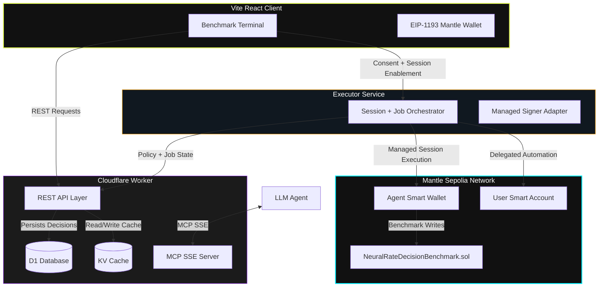

# NeuralRate MCP — AI Trust and Execution Layer for RWA Allocation on Mantle

NeuralRate MCP is an AI trust and execution layer for policy-constrained RWA allocation on the **Mantle Network**.

It leverages real-time yields data, macroeconomic indicators, and institutional orderflow signals to assess risk deterministically using a **6-factor Risk Assessment Model** and calculate optimal allocations. Built for AI-agent interoperability, NeuralRate exposes its capabilities directly to Large Language Models (LLMs) via the **Model Context Protocol (MCP)**, includes an operator-facing benchmark terminal, and now ships a **signed-consent, per-user benchmark and automation flow** on Mantle Sepolia:

* **Wallet-first signed mutations for every state-changing user action**
* **User control wallet for consent, ownership, and revocation**
* **Dedicated vault / smart account per user**
* **Personalized agent configuration per user**
* **Global NeuralRate benchmark identity kept separate from user funds**
* **Dedicated executor service for vault-scoped automation orchestration**
* **On-chain benchmark writes with local-to-chain audit trail**

The public benchmark contract remains global, while user funds and execution policies are isolated inside a dedicated vault for each user. This prevents shared-balance blast radius and keeps recommendations scoped to the user’s own configuration.



---

## 📂 Repository Layout

The project is structured as a monorepo containing the following components:

* **`/apps/worker`**: The Cloudflare Worker backend. Exposes a signed-mutation REST API for the operator-facing web app and runs the stateful Model Context Protocol (MCP) server over Server-Sent Events (SSE). Integrates Cloudflare KV caching and D1 SQLite storage.
* **`/apps/web`**: The Vite React frontend benchmark terminal, featuring dark glassmorphism styling, custom OKLCH colors, native EIP-1193 wallet integration, per-user vault bootstrap, wallet-ownership handoff, personalized agent settings, and vault-scoped automation consent on Mantle Sepolia.
* **`/apps/executor`**: The dedicated automation service. Prepares vault-scoped permissions, tracks activation / revocation, and owns the autonomous job queue without ever holding user keys.
* **`/contracts`**: The Hardhat development workspace containing `NeuralRateDecisionBenchmark.sol`, `NeuralRateUsdYStrategyAdapter.sol`, and `NeuralRateVaultModule.sol` for real Safe-module execution on Mantle Sepolia.
* **`/docs`**: Comprehensive, zero-speculation technical documentation of the entire platform:
  1. [System Architecture Guide](docs/architecture.md) — Structural layout, data flow, and caching strategy.
  2. [MCP Server Specifications](docs/mcp-server.md) — 7 tools definitions and the complete formulas for the 6-factor Risk Model.
  3. [Smart Contract Documentation](docs/smart-contract.md) — Functions, modifiers, variables, and events.
  4. [Frontend UI Reference](docs/frontend.md) — Component architecture, EIP-1193 Mantle Sepolia hook, and glassmorphism styling.
  5. [Database Schema](docs/database.md) — SQLite Cloudflare D1 schema columns and tables representation.
  6. [Hackathon Submission Pack](docs/hackathon-submission.md) — One-liner, demo script, trust model, architecture slide outline, and feature matrix.

## 🔗 Live Mantle Sepolia Deployments

* **Benchmark Registry:** [`0xc51560a5512d2A5756435d87319aeaE1bA480165`](https://sepolia.mantlescan.xyz/address/0xc51560a5512d2A5756435d87319aeaE1bA480165)
* **NeuralRate Vault Module:** [`0xDAbB583bDE28241F1e3C61B423CF456D07f4DA11`](https://sepolia.mantlescan.xyz/address/0xDAbB583bDE28241F1e3C61B423CF456D07f4DA11)
* **Vault Module Deploy Tx:** [`0x363de6d6b9153986eb3eddb5089849c5943fc1c1a49b85f4e361f34a5976f556`](https://sepolia.mantlescan.xyz/tx/0x363de6d6b9153986eb3eddb5089849c5943fc1c1a49b85f4e361f34a5976f556)
* **USDY Strategy Adapter:** [`0xFeE16FAd13789e9bBA4779D025186341e58799a3`](https://sepolia.mantlescan.xyz/address/0xFeE16FAd13789e9bBA4779D025186341e58799a3)
* **USDY Adapter Deploy Tx:** [`0xee3a1caa73baaa8d3adcd103d44d9bf424b5612b660fc642bc40e11287a9e3c8`](https://sepolia.mantlescan.xyz/tx/0xee3a1caa73baaa8d3adcd103d44d9bf424b5612b660fc642bc40e11287a9e3c8)

Sepolia honesty note:
- The app now treats `USDY` on Mantle Sepolia as **blocked until a canonical Sepolia venue is explicitly validated**.
- The default real execution demo on Sepolia is now a **native `MNT` transfer** through the Safe module.

---

## ⚡ Quick Start (Local Development)

To run the full workspace locally, launch the backend and frontend services simultaneously:

### 1. Prerequisite Variables
Ensure you have a `.env` file in the root workspace configured with the required third-party API credentials:
```env
FRED_API_KEY="your_fred_api_key"
NANSEN_API_KEY="your_nansen_api_key"
VITE_PUBLIC_MANTLE_RPC_URL="https://rpc.sepolia.mantle.xyz"
VITE_PUBLIC_NEURALRATE_BENCHMARK_CONTRACT="0xc51560a5512d2A5756435d87319aeaE1bA480165"
VITE_PUBLIC_ERC8004_AGENT_ID="49"
VITE_PUBLIC_ERC8004_IDENTITY_REGISTRY="0x8004A818BFB912233c491871b3d84c89A494BD9e"
EXECUTOR_BASE_URL="http://127.0.0.1:8788" # Worker-to-executor internal URL. Do not expose this in the frontend.
VITE_PUBLIC_NEURALRATE_AGENT_SMART_WALLET="0xYourAgentSmartWallet"
NEURALRATE_AGENT_SESSION_SIGNER_ADDRESS="0xYourAgentSessionSigner"
NEURALRATE_USDY_STRATEGY_EXECUTOR_ADDRESS="0xYourTurnkeyOrSessionSigner"
NEURALRATE_VAULT_MODULE_EXECUTOR_ADDRESS="0xYourTurnkeyOrSessionSigner"
NEURALRATE_USDY_TOKEN_ADDRESS="0xYourUsdYTokenOnMantleSepolia"
NEURALRATE_USDY_STRATEGY_RECIPIENT_ADDRESS="0xYourUsdYStrategyRecipient"
NEURALRATE_MNT_STRATEGY_RECIPIENT_ADDRESS="" # Optional; defaults to the owner EOA for Sepolia MNT demo transfers
VITE_PUBLIC_NEURALRATE_VAULT_MODULE_ADDRESS="0xYourDeployedVaultModule"
VITE_PUBLIC_NEURALRATE_VAULT_PROVIDER_STRATEGY="safe-primary"
VITE_PUBLIC_NEURALRATE_ONBOARDING_PROVIDER="privy"
VITE_PUBLIC_NEURALRATE_MANAGED_SIGNER_PROVIDER="turnkey"
NEURALRATE_INTERNAL_API_TOKEN="local-neuralrate-internal"
NEURALRATE_DEMO_STRATEGY_KEY="mnt-native-transfer"
NEURALRATE_DEMO_TARGET_ASSET="MNT"
# Legacy fallback only. The primary strategy path resolves the approved adapter
# from the repo-pinned registry after deployment to Mantle Sepolia.
NEURALRATE_DEMO_TARGET_CONTRACT=""
NEURALRATE_DEMO_CALLDATA=""
```

Before enabling live strategy execution, deploy the Safe module once on Mantle Sepolia:
```bash
cd contracts
npm install
npm run deploy:vault-module:sepolia
```
This script writes the pinned deployment manifest consumed by the executor at `apps/executor/src/generated/vaultModuleDeployment.ts`.

### 2. Run the Cloudflare Worker Backend
Navigate to the worker directory, install dependencies, and start Wrangler's local development server:
```bash
cd apps/worker
npm install
npx wrangler dev
```
* The backend will boot at `http://localhost:8787` (CORS headers enabled for local frontend requests).
* Exposes REST endpoints under `/api/*` and the stateful SSE agent connection stream at `/mcp`.
* Mutating browser requests use wallet-signed nonces; executor-to-worker writes use the internal API token configured as `INTERNAL_API_TOKEN` in `wrangler.toml` / `.dev.vars`, and it must match the root/executor `NEURALRATE_INTERNAL_API_TOKEN`.

### 3. Run the Vite React Frontend
In a new terminal window, navigate to the web app directory, install dependencies, and launch Vite's HMR dev server:
```bash
cd apps/web
npm install
npm run dev
```
* The frontend app will open at `http://localhost:5173`.
* Standardizes to Mantle Sepolia (Chain ID `5003`).
* The benchmark terminal can run entirely on the built-in Sepolia defaults, or read the public contract / explorer / Safe-module overrides from `apps/web/.env.example`.
* The default Sepolia execution path is a real native `MNT` Safe-module transfer. The legacy `USDY` path is preserved in code, but is explicitly blocked until a canonical Sepolia venue is validated.

### 4. Run the Executor Service
In a third terminal window, launch the automation executor:
```bash
cd apps/executor
npm install
npm run dev
```
* The executor boots at `http://localhost:8788`.
* It is an internal dispatch service. The Worker is the public control plane and is the only service that should call the executor.
* For `USDY` on Sepolia, the executor now fails closed with an explicit “canonical Sepolia venue not configured” reason instead of pretending an Ondo venue exists on testnet.
* For the live Sepolia demo, the executor uses the pinned `NeuralRateVaultModule` to dispatch a real `MNT` transfer from the user Safe.

---

## 🛡️ Core Features Deployed

1. **6-Factor Deterministic Risk Engine:** Evaluates protocols based on TVL, Volume utilization (detecting lending pools automatically), APY sustainability, Yield Composition (base vs reward incentives), IL risk, and Nansen Smart Money flows.
2. **Per-User Vault Isolation:** Every user gets a dedicated vault / smart account, so no user funds are pooled behind a shared agent treasury.
3. **Personalized Agent Settings:** Recommendations are ranked from global market data but filtered and capped by the user’s own vault policy, presets, allowlists, and automation limits.
4. **Signed Grant and Policy Verification:** The owner wallet issues a canonical automation grant bound to one vault, one policy version, and one MCP session scope, with revocation and audit history in D1.
5. **Worker-Gated Executor Orchestration:** Decisions are generated and stored locally in D1 first, then the Worker validates policy and dispatches benchmark or execution jobs to the internal executor under a revocable user-vault policy model.
6. **Agent-Access MCP Portal:** Connects AI agents directly to NeuralRate tools and now exposes the same vault control plane for state, policy, grants, benchmark jobs, and execution jobs.
