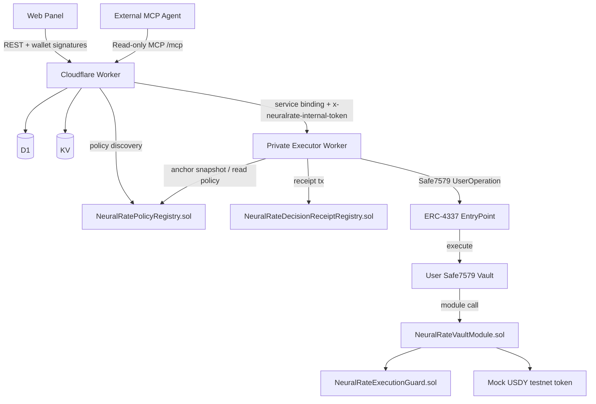

# System Architecture

**Status:** Canonical doc

This document describes the architecture implemented in the repository after the on-chain policy, Safe7579 execution, and Mock USDY Sepolia demo refactors.

## Topology

NeuralRate has three runtime services plus on-chain contracts:

1. `apps/worker`
   Public REST surface plus MCP catalogs.
2. `apps/executor`
   Internal dispatch service for receipt and strategy jobs.
3. `apps/web`
   User and operator panel.
4. Mantle Sepolia contracts
   Policy registry, execution guard, receipt registry, Safe vault module, delegate validator, preserved USDY adapter, and testnet-only Mock USDY harness.



## Public vs Internal Boundaries

- **Public**
  - worker REST endpoints under `/api/*`
  - worker read-only MCP endpoint at `/mcp`
  - worker scoped MCP catalogs at `/mcp/scoped/state`, `/mcp/scoped/config`, `/mcp/scoped/benchmark`, and `/mcp/scoped/execution`
  - web frontend
- **Internal**
  - executor HTTP API
  - worker-to-executor service-bound token-authenticated calls

The browser should not call the executor directly.

## Cloudflare Durable Objects MCP Routing

To ensure high performance and isolation, `apps/worker` leverages Cloudflare Durable Objects (DO) to run the Model Context Protocol (MCP) server instances. The Worker resolves incoming HTTP requests (or SSE streams) and forwards them to the appropriate Durable Object based on the route and session domain:

1. **Public Read-Only Catalog (`/mcp` / SSE `/sse`)**:
   - Class: `NeuralRateReadonlyMcpAgent`
   - Binding: `MCP_READONLY_OBJECT`
   - Purpose: Exposes read-only tools publicly without requiring session authorization.
2. **Scoped Configuration Catalog (`/mcp/scoped/config` / SSE `/sse/scoped/config`)**:
   - Class: `NeuralRateConfigMcpAgent`
   - Binding: `MCP_CONFIG_OBJECT`
   - Purpose: Exposes scoped policy, grant, and runtime-management tools, restricted to sessions carrying `config` domain approval.
3. **Scoped State Catalog (`/mcp/scoped/state` / SSE `/sse/scoped/state`)**:
   - Class: `NeuralRateStateMcpAgent`
   - Binding: `MCP_STATE_OBJECT`
   - Purpose: Exposes scoped vault state, balances, policy surface, activity, and audit-oriented read tools.
4. **Scoped Benchmarking Catalog (`/mcp/scoped/benchmark` / SSE `/sse/scoped/benchmark`)**:
   - Class: `NeuralRateBenchmarkMcpAgent`
   - Binding: `MCP_BENCHMARK_OBJECT`
   - Purpose: Exposes `queue_benchmark` plus `get_benchmark_history`, restricted to sessions carrying `benchmark` domain approval.
5. **Scoped Strategy Execution Catalog (`/mcp/scoped/execution` / SSE `/sse/scoped/execution`)**:
   - Class: `NeuralRateExecutionMcpAgent`
   - Binding: `MCP_EXECUTION_OBJECT`
   - Purpose: Exposes governed execution and strategy tools, restricted to sessions carrying `execution` domain approval.

## Telemetry and Balance Pipeline

To track client errors and system health, a logging pipeline is integrated:
1. When a client-side exception or connection failure occurs, the **web app** POSTs a telemetry payload to the worker endpoint `/api/telemetry/error`.
2. The **Worker** validates the payload and inserts the event details (source, level, message, route, and metadata JSON) into the D1 `telemetry_events` table.
3. Operators can retrieve the last 24h error metrics via `/api/telemetry/summary`.

Vault balance telemetry is derived from on-chain reads rather than a user-declared funding record:

1. The worker reads the Safe vault native balance and configured tracked ERC-20 balances.
2. When `NEURALRATE_USDY_TOKEN_ADDRESS` is configured, the worker includes Mock USDY as a tracked token in `runtimeState.tokenBalances`.
3. The web `Telemetry` panel renders the worker snapshot and can show native MNT plus live ERC-20 balances such as Mock USDY.
4. Direct vault deposits and Mock USDY mints are therefore reflected by the next live/cached on-chain balance refresh, without creating a separate funding-intent mutation.

## Release and Configuration Boundary

The repository now separates release-time address sync from secret injection:

- checked-in release artifacts
  - `deployments/*.json`
  - `apps/worker/wrangler.toml`
  - `*.env.example`
- local-only operator files
  - `/.env`
  - `apps/executor/.env.local`
  - `apps/worker/.dev.vars`
- platform-managed secrets
  - Cloudflare Worker secrets
  - private executor Worker secrets

Recommended release check:

```bash
npm run sync:deployments
npm run preflight:release
```

This keeps plaintext AA addresses versioned while leaving actual secrets outside git.

## Responsibility Split

### Worker

The worker is now mostly a control plane and indexing layer.

- serves market data endpoints and deterministic analytics
- stores user state and historical metadata in D1
- caches provider responses in KV
- verifies wallet-signed auth nonces for owner actions
- issues grant/session records for MCP scoping
- exposes read-only MCP publicly
- exposes scoped mutation catalogs only when a valid `sessionToken` is presented at the route level
- overlays on-chain policy state into `AutomationState`
- forwards benchmark and execution jobs to the executor

### Executor

The executor is the dispatch layer. Governed vault automation uses the Safe7579/ERC-4337 runtime only: it builds an ERC-4337 `UserOperation` calling `execute` on the Safe, targeting the vault module or policy registry, signed by the managed signer and validated on-chain by `NeuralRateDelegateValidator.sol`.

The bundler/paymaster preparation step may return the Safe7579 placeholder signature (`0x11...`). The executor signs the prepared UserOperation with the managed account before submission and refuses to dispatch if the final signature is still the placeholder. This keeps `AA24 signature error` regressions inside tests and pre-submission checks.

There is no legacy direct-signer fallback for user onboarding or vault automation. If AA runtime prerequisites are missing, execution must fail as configuration or funding-not-ready rather than silently switching authority models.

Core responsibilities:
- runs as a private Cloudflare Worker with `workers_dev = false`
- accepts traffic only from the public worker through a Cloudflare service binding
- requires `x-neuralrate-internal-token`
- resolves the active on-chain policy before execution
- anchors `snapshotHash` and `snapshotCid` in the policy registry when needed
- validates pinned strategy configuration
- builds receipt-registry writes for decisions
- submits vault execution transactions through the Safe7579 and Safe module path
- reports job status back to the worker

### Web

The web app remains the owner-operated panel.

- connects the user wallet on Mantle Sepolia
- bootstraps user and vault state through the worker
- gathers only the owner signatures required for bootstrap, policy publication, and scoped grant authorization
- publishes the active policy on-chain when automation is enabled or settings change
- revokes the active policy on-chain when automation is disabled
- shows settings, vault state, grants, sessions, jobs, and benchmark history
- queues benchmark and execution actions through the worker

## Main Flows

### 1. Analytics Flow

1. Web or agent calls the worker.
2. Worker reads cache or fetches from upstream providers.
3. Worker computes deterministic scoring and allocation output.
4. Worker returns structured JSON.

### 2. Owner-Signed Mutation Flow

For direct owner mutations:

1. Client requests `/api/auth/nonce`.
2. Owner wallet signs the nonce envelope.
3. Worker verifies signature and nonce freshness.
4. Worker executes the requested mutation or policy update.
5. The web app can then mirror the resulting limits to the on-chain policy registry.

### 3. Scoped MCP Catalog Flow

1. Owner signs a canonical automation grant.
2. Worker stores the grant and a short-lived `sessionToken`.
3. A scoped MCP route is requested with that `sessionToken`.
4. The worker verifies the route domain against the session before serving the MCP catalog.
5. Only the matching mutation tool is advertised on that scoped route.

This means catalog exposure is reduced before the model sees the tool list.

### 4. Policy Publication Flow

1. The web app saves the user policy through the worker for indexed state.
2. The web app publishes the same active policy directly on-chain through `NeuralRatePolicyRegistry`.
3. The policy records delegate, caps, allowlists, validity windows, and snapshot requirements.

### 5. Minimal Onboarding Runtime Flow

1. The owner bootstraps a dedicated Safe vault and confirms wallet ownership in the same signed mutation.
2. The owner uses one guided authorization action to publish policy, sign the scoped MCP grant, and activate the runtime.
3. Runtime activation uses the Safe7579/ERC-4337 path only. Safe admin changes are batched into a single Safe transaction whenever the Safe already exists.
4. Platform-owned execution guard trust settings are deployment prerequisites. They are not exposed as user onboarding steps.
5. Funding is optional and can happen before or after activation; users fund by sending any amount directly to the vault address, and the app derives funding state from live on-chain balance reads.

### 6. Decision Receipt Flow

1. A decision is logged locally in D1.
2. The worker queues a benchmark-style receipt job.
3. The executor resolves the active on-chain policy.
4. The executor anchors the referenced snapshot if needed.
5. The executor submits `createDecisionReceipt` on `NeuralRateDecisionReceiptRegistry.sol`.
6. The worker persists `tx_hash`, on-chain receipt metadata, and job status.

### 7. Strategy Execution Flow

1. The worker validates scoped access and queues a strategy job.
2. The worker forwards the job to the private executor through the internal service binding.
3. The executor resolves the active on-chain policy.
4. The executor anchors the referenced snapshot if needed.
5. The executor builds an intent with snapshot hash, slippage, deadline, and policy version.
6. The executor prepares the Safe7579 UserOperation, replaces the placeholder signature with a managed-signer signature, and submits it through the bundler/paymaster path.
7. `NeuralRateExecutionGuard` validates the execution when the module call is made.
8. The module executes the real Safe call with `execTransactionFromModule`.
9. For the Mock USDY Sepolia demo, the final module call is an ERC-20 `transfer` from the Safe vault to the configured recipient.

### 8. Current Sepolia Execution Proof

On 2026-06-12, a scoped MCP `open_position` call using `protocolHint: "mock-usdy-sepolia"` confirmed the full path:

- strategy: `mock-usdy-sepolia-allocation`
- Safe vault: `0xa151ca59f090946ab1ac1f8028771ec716a9a82f`
- Mock USDY token: `0xC63FB10deD215c6De6cDB438FB2Ce7944F6Af5bE`
- amount: `1 USDY`
- userOpHash: `0x3b55075fed671db366b2e1fc6447da31b0fb149e0e739f337dfbf5099168b637`
- tx_hash: `0x36281947f5fb3088c29e6926979f150eb10ee03e5be86e4973599bf8823409b6`
- result: transaction receipt status `1`; vault Mock USDY balance decreased from `10000` to `9999`

## Persistence and Cache

### D1

The worker still stores:

- decisions
- user profiles and configs
- vaults and permissions
- automation policies and sessions
- automation jobs and benchmark jobs
- auth nonces
- automation grants
- MCP session records

### KV

Current TTL behavior implemented in code:

- DefiLlama yields: `300s`
- FRED T-Bill data: `3600s`
- Nansen positive cache: soft `600s`, hard `1800s`
- Nansen negative cache: `300s`

## Trust Boundaries

- Execution authority is intended to come from on-chain policy plus guard validation, not from the worker alone.
- The worker still scopes MCP discovery and stores index state, but it is no longer the only meaningful execution gate.
- The executor is private, but it must still satisfy the on-chain policy and snapshot path.
- The Safe module address is pinned and verified before execution.
- Public contract addresses are allowed in versioned Worker `vars`, but tokens, API keys, and internal auth material must stay in secret storage rather than `wrangler.toml`.
