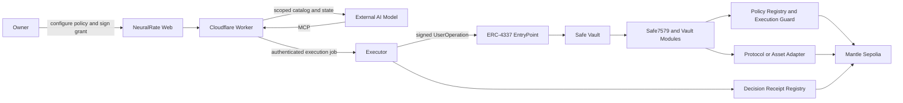

# NeuralRate MCP - Mantle Turing Test Hackathon 2026

**Submission status:** Final

**Network:** Mantle Sepolia, chain ID `5003`

**Primary product:** MCP safety, authorization, and execution layer for external AI models

## Submission Links

| Resource | Link |
| --- | --- |
| Live application | [neuralrate.pages.dev](https://neuralrate.pages.dev/) |
| Source code | [github.com/Lipe-lx/NeuralRate-MCP](https://github.com/Lipe-lx/NeuralRate-MCP) |
| Public MCP endpoint | [`https://neuralrate-worker.neuralrate.workers.dev/mcp`](https://neuralrate-worker.neuralrate.workers.dev/mcp) |
| API base | [`https://neuralrate-worker.neuralrate.workers.dev/api`](https://neuralrate-worker.neuralrate.workers.dev/api) |
| Hackathon | [Mantle Turing Test Hackathon 2026](https://dorahacks.io/hackathon/mantleturingtesthackathon2026/detail) |
| Submission video guide | [Recommended sequence, narration, and recording checklist](#suggested-submission-video) |

## One-Liner

NeuralRate is the MCP safety layer for external AI models: the owner defines the vault, permissions, limits, and expiry; the agent receives only the authorized tools; and every execution must pass verified policy before it can move assets on Mantle.

## Executive Summary

AI models can reason about on-chain opportunities, but giving an external model unrestricted wallet or protocol access is not acceptable. A model should not inherit the full authority of the owner merely because it can call a tool.

NeuralRate turns Model Context Protocol into a constrained Web3 execution boundary:

1. The owner creates or connects a dedicated Safe vault.
2. The owner defines an explicit policy and signs a time-bounded automation grant.
3. NeuralRate issues a short-lived scoped MCP session.
4. The external AI model discovers only the tools allowed by that session.
5. Every mutation passes schema validation, scope checks, runtime readiness, and on-chain policy checks.
6. Approved actions execute through Safe7579 and ERC-4337 on Mantle.
7. The system returns auditable evidence, including the job, UserOperation, transaction, policy, and decision receipt identifiers.

The model remains the reasoning layer. NeuralRate is the authorization, execution, and evidence layer.

## The Problem

Most agent demos optimize for what an AI can do. Production systems also need to prove what the AI cannot do.

Direct wallet access creates several unresolved risks:

- the agent can discover or call more capabilities than the owner intended;
- a leaked credential can inherit broad and long-lived authority;
- off-chain prompt rules are not enforceable execution policy;
- unsupported protocol paths may fail unpredictably instead of failing closed;
- the owner may have no consistent evidence linking a model decision to an on-chain action;
- revocation, expiry, and per-vault limits are often afterthoughts.

NeuralRate addresses these risks at the capability, session, runtime, and on-chain layers.

## What NeuralRate Delivers

### 1. MCP Is the Product Surface

NeuralRate is designed for external AI clients, not for a model embedded inside the website. Any compatible client can connect through MCP, inspect the catalog it is allowed to see, read structured vault state, and request authorized actions.

The web application is the owner console. It is used to configure the vault, publish policy, issue or revoke grants, inspect readiness, fund the vault, and audit execution.

### 2. Capability Discovery Is Scoped

The public endpoint exposes only five read-only advisory tools:

- `yield_scan`
- `tbill_spread`
- `nansen_context`
- `risk_assess`
- `optimal_allocation`

Vault state and execution tools are available only through owner-issued scoped sessions. A model does not receive a universal catalog and then rely on prompt discipline. Unauthorized tools are excluded from its effective capability surface.

### 3. Authority Is Explicit and Expiring

Scoped sessions derive from a canonical automation grant that binds authority to:

- the owner;
- the Safe vault;
- the approved MCP domain;
- the granted catalog scopes;
- the active policy;
- the session expiry;
- the signed nonce envelope.

Grants can expire or be revoked without exposing an owner private key to the AI model.

### 4. Execution Fails Closed

Passing MCP authentication is necessary but not sufficient. Before dispatch, NeuralRate verifies:

- session validity and scope;
- request schema and action semantics;
- Safe vault and runtime configuration;
- policy publication and active limits;
- trusted execution modules;
- paymaster and ERC-4337 readiness when required;
- configured token, strategy, adapter, and venue support.

Missing or inconsistent dependencies block the action with an explicit reason.

### 5. Policy Is Enforced On-Chain

The execution path uses a policy registry, execution guard, vault module, Safe7579 adapter, delegate validator, and Safe ERC-4337 module. The owner-defined boundary is therefore not only an API convention.

### 6. Every Successful Path Produces Evidence

NeuralRate correlates:

- MCP request and scoped session;
- normalized action and policy decision;
- queued execution job;
- prepared and signed UserOperation;
- Mantle transaction hash;
- anchored snapshot;
- on-chain decision receipt.

This gives judges and owners a concrete trail from agent intent to chain result.

## Why It Is Different

NeuralRate is not another yield dashboard, autonomous trading bot, or single-strategy agent.

Its strongest differentiators are:

- **Model-independent:** external AI models connect through MCP instead of being bundled into the product.
- **Least-capability discovery:** the agent sees only the tools granted to its session.
- **Owner-controlled authority:** vault, limits, scopes, and expiry originate from the owner.
- **Layered enforcement:** tool scope, runtime readiness, and on-chain policy must all agree.
- **Fail-closed protocol routing:** an unsupported venue does not silently become a simulated success.
- **Real smart-account execution:** the current proof uses Safe7579, ERC-4337, a signed UserOperation, and a paymaster.
- **Verifiable evidence:** transaction and decision identifiers are first-class product outputs.
- **Reusable foundation:** the same governed action model can sit in front of additional Web3 protocols without giving agents unrestricted wallet access.

The project is intentionally infrastructure-first. The current USDY flow proves the safety architecture; NeuralRate's larger value is the authorization envelope around any compatible agent tool.

## System Architecture



### Components

| Component | Responsibility |
| --- | --- |
| Web application | Owner configuration, signatures, vault telemetry, grant lifecycle, and audit UI |
| Worker | Public API and MCP gateway, authentication, scoped sessions, indexed state, and job queueing |
| Executor | Internal policy resolution, preflight, snapshot anchoring, UserOperation signing, and submission |
| Safe vault | Dedicated owner-controlled smart account that holds assets and executes approved calls |
| Policy contracts | On-chain policy state and execution checks |
| Receipt registry | On-chain evidence for benchmark decisions and execution outcomes |

## MCP Surface

| Catalog | Access | Purpose |
| --- | --- | --- |
| Public | No vault session; read-only | Market context, risk analysis, and allocation suggestions |
| State | Scoped session | Vault, balances, positions, policy, readiness, and audit state |
| Config | Scoped owner authority | Policy, automation, and configuration lifecycle |
| Benchmark | Scoped session | Decision logging, queueing, and on-chain receipt evidence |
| Execution | Scoped execution grant | Governed asset and strategy actions |

Canonical scoped authentication uses the `x-neuralrate-session-token` header. Session tokens are short-lived and are not owner wallet credentials.

## Governed Web3 Action Coverage

The project already contains a normalized governed action model. The roadmap is not to invent swaps, staking, lending, or treasury tools from zero. The next step is to bind the existing safety envelope to more real protocol-specific adapters and venues.

| Action family | Current state |
| --- | --- |
| Native asset transfer | Queueable today through the Safe module |
| ERC-20 Mock USDY allocation | Queueable today through the Safe module |
| Open or increase USDY position | Queueable for the configured Mantle Sepolia Mock USDY route |
| Decrease or close wallet-held MNT/USDY position | Queueable for supported wallet-held assets |
| Sweep idle MNT | Queueable today |
| Rebalance target allocation | Queueable into the configured USDY route |
| Approve strategy spender | Queueable with policy and runtime checks |
| Reward claim | Returns a no-op when no reward exists; fails closed when a required adapter is absent |
| Strategy rotation | Supports the current configured route or no-op behavior; unsupported multi-venue paths fail closed |
| Canonical third-party USDY venue on Sepolia | Not claimed; no canonical public Ondo USDY Sepolia venue is configured |
| Broad swap, staking, lending, and treasury venue coverage | Roadmap: requires pinned, reviewed protocol adapters |

## Current Strategies

### `mnt-native-transfer`

- real native MNT transfer through the Safe module;
- used to validate native smart-account execution.

### `mock-usdy-sepolia-allocation`

- current ERC-20 Mantle Sepolia execution harness;
- uses Mock USDY held by the agent Safe;
- follows the same scoped MCP, policy, Safe module, and ERC-4337 path used by the production architecture;
- clearly disclosed as a testnet substitute.

### `usdy-stable-allocation`

- preserved as the canonical USDY strategy definition;
- not presented as a live Sepolia venue;
- fails closed when no canonical venue is configured.

Ondo does not provide a canonical public USDY deployment for the current Mantle Sepolia demo path. NeuralRate therefore uses a separately labeled Mock USDY contract on testnet and does not represent it as mainnet USDY.

## End-to-End Demo

### Owner Flow

1. Open the live application and connect a wallet on Mantle Sepolia.
2. Bootstrap or load the dedicated Safe vault.
3. Review the owner, vault, policy limits, session duration, and permitted capabilities.
4. Sign the authorization action.
5. NeuralRate publishes the active policy, configures the Safe runtime when needed, and creates the scoped MCP session.
6. Fund the vault directly. The interface detects balances from the chain.

### External AI Flow

1. Connect the AI client to the public MCP endpoint.
2. Inspect the five read-only advisory tools.
3. Connect to the appropriate scoped MCP catalog with the owner-issued session token.
4. Call `get_execution_readiness` and confirm that the policy, vault, modules, and execution dependencies are ready.
5. Read balances, policy, and positions.
6. Request a supported action such as `open_position`.
7. Receive the queued job and follow its execution evidence.

### On-Chain Flow

1. The Worker validates the scoped request and queues an authenticated job.
2. The Executor resolves the strategy and live on-chain policy.
3. The Executor anchors the referenced state snapshot.
4. A real Safe7579 UserOperation is prepared and signed.
5. The UserOperation is submitted through ERC-4337.
6. The Safe module executes the allowed asset call.
7. NeuralRate records the transaction and decision proof.

## Current Live Proof

On **June 12, 2026**, a scoped MCP `open_position` request completed the full Mock USDY execution path on Mantle Sepolia.

| Evidence | Value |
| --- | --- |
| Tool | `open_position` |
| Protocol hint | `mock-usdy-sepolia` |
| Strategy | `mock-usdy-sepolia-allocation` |
| Amount | `1 USDY` |
| Safe vault | `0xa151ca59f090946ab1ac1f8028771ec716a9a82f` |
| Mock USDY | `0xC63FB10deD215c6De6cDB438FB2Ce7944F6Af5bE` |
| Job ID | `job_45f65784-6756-4124-9a75-7870c8b66806` |
| UserOperation hash | `0x3b55075fed671db366b2e1fc6447da31b0fb149e0e739f337dfbf5099168b637` |
| Transaction | [`0x36281947...23409b6`](https://sepolia.mantlescan.xyz/tx/0x36281947f5fb3088c29e6926979f150eb10ee03e5be86e4973599bf8823409b6) |
| Receipt | Status `1`; paymaster-funded; snapshot anchored |
| Balance result | Safe Mock USDY balance changed from `10000` to `9999` |

This proof demonstrates a real scoped MCP request, real smart-account execution, and a successful Mantle transaction. It does not claim that Mock USDY is canonical Ondo USDY.

## Deployed Contracts

All addresses below are on Mantle Sepolia, chain ID `5003`.

| Contract | Address |
| --- | --- |
| Policy Registry | [`0x86cD4f8c2528E71a473ED342aa73B8a00de906a4`](https://sepolia.mantlescan.xyz/address/0x86cD4f8c2528E71a473ED342aa73B8a00de906a4) |
| Execution Guard | [`0x666Bc822156824F40F2b70aAaAcBfe87467D79A5`](https://sepolia.mantlescan.xyz/address/0x666Bc822156824F40F2b70aAaAcBfe87467D79A5) |
| Decision Receipt Registry | [`0xC0C836A220D006398cdE4D5caf529196E63f81A8`](https://sepolia.mantlescan.xyz/address/0xC0C836A220D006398cdE4D5caf529196E63f81A8) |
| Vault Module | [`0xACBB78DAB5D1404C9eeC1E90BCe569cD1acc91bF`](https://sepolia.mantlescan.xyz/address/0xACBB78DAB5D1404C9eeC1E90BCe569cD1acc91bF) |
| Delegate Validator | [`0x0A03F7763d53757183aD86C393eEfF6D8177e4cE`](https://sepolia.mantlescan.xyz/address/0x0A03F7763d53757183aD86C393eEfF6D8177e4cE) |
| Safe4337 Module | [`0x62B79C3dF9F15A94ce821ac558ED74F011bB7a41`](https://sepolia.mantlescan.xyz/address/0x62B79C3dF9F15A94ce821ac558ED74F011bB7a41) |
| Safe7579 Adapter | [`0x7ec994fD2F774Fb8AAe472C349ED3E64E0A15FEa`](https://sepolia.mantlescan.xyz/address/0x7ec994fD2F774Fb8AAe472C349ED3E64E0A15FEa) |
| Safe7579 Launchpad | [`0x16794305Ccd57F815cf81d7fE20d6B6b4E82AAd2`](https://sepolia.mantlescan.xyz/address/0x16794305Ccd57F815cf81d7fE20d6B6b4E82AAd2) |
| Safe Module Setup | [`0xb0D93d0F34094f754Caf675556DEE18A50df795B`](https://sepolia.mantlescan.xyz/address/0xb0D93d0F34094f754Caf675556DEE18A50df795B) |
| USDY Strategy Adapter | [`0xFeE16FAd13789e9bBA4779D025186341e58799a3`](https://sepolia.mantlescan.xyz/address/0xFeE16FAd13789e9bBA4779D025186341e58799a3) |
| Mock USDY | [`0xC63FB10deD215c6De6cDB438FB2Ce7944F6Af5bE`](https://sepolia.mantlescan.xyz/address/0xC63FB10deD215c6De6cDB438FB2Ce7944F6Af5bE) |

Deployment metadata, runtime bytecode hashes, and source hashes are published in [`apps/web/public/verify/deployments.json`](../apps/web/public/verify/deployments.json).

## Mantle Integration

Mantle is not only the destination chain for a receipt. It is the execution environment for:

- owner policy publication;
- dedicated Safe vaults;
- Safe7579 and ERC-4337 account abstraction;
- paymaster-backed UserOperations;
- native MNT transfers;
- Mock USDY ERC-20 testnet execution;
- policy and guard enforcement;
- decision receipt anchoring;
- EIP-8004 agent registration.

The registered NeuralRate agent uses agent ID `49` in the EIP-8004 registry at [`0x8004A818BFB912233c491871b3d84c89A494BD9e`](https://sepolia.mantlescan.xyz/address/0x8004A818BFB912233c491871b3d84c89A494BD9e).

## Security and Trust Model

### Owner-Controlled

- The owner controls the vault and signs mutations.
- The owner chooses permissions, limits, and expiry.
- The owner can revoke the grant.
- The AI model never receives the owner private key.

### Worker Responsibilities

- authenticate signed owner requests;
- issue scoped, time-bounded sessions;
- expose the correct catalog;
- normalize and validate tool input;
- queue only authorized jobs;
- persist indexed state and evidence.

### Executor Responsibilities

- accept only worker-authenticated internal requests;
- resolve the active on-chain policy;
- verify trusted module configuration;
- anchor snapshots;
- sign prepared UserOperations;
- submit and track Mantle transactions.

### On-Chain Responsibilities

- store the active policy;
- restrict execution through trusted modules;
- enforce configured selectors and limits;
- execute Safe calls;
- preserve decision evidence.

### Explicit Trust Assumptions

- the Worker and Executor are operated services and remain part of the trusted computing base;
- the owner must review the policy and authorization envelope before signing;
- each new protocol adapter requires explicit implementation and review;
- testnet infrastructure and paymaster availability can affect demo readiness;
- NeuralRate reduces agent authority but does not claim to make arbitrary protocols risk-free.

## Honest Limitations

This submission does **not** claim:

- universal execution against arbitrary Web3 protocols;
- canonical Ondo USDY execution on Mantle Sepolia;
- a production mainnet deployment;
- trustless off-chain infrastructure;
- audited support for every token or strategy;
- that an AI model can bypass owner-granted scope;
- that a successful advisory recommendation is automatically executable.

The current implementation proves the authorization and execution architecture with supported Mantle Sepolia routes. Unsupported routes fail closed.

## Roadmap

### Foundation - Live

- external-model access through MCP;
- public and scoped capability catalogs;
- owner-issued, expiring grants;
- Safe vaults and policy enforcement;
- Safe7579 and ERC-4337 execution;
- on-chain evidence and audit trail.

### Broader Protocol Coverage - Next

The action model already includes transfers, position lifecycle, rebalancing, approvals, reward checks, and strategy rotation. The next milestone is to connect these governed actions to reviewed, protocol-specific venues:

- pinned swap adapters and routers;
- staking and restaking integrations;
- lending market adapters;
- treasury operation adapters;
- broader asset and position accounting.

### Multi-Chain Policy Runtime - Planned

- chain-aware deployment manifests;
- consistent owner scopes across additional EVM networks;
- network-specific readiness and policy verification;
- unified cross-chain evidence views.

### Open Safety Infrastructure - Vision

- integration SDK for governed MCP tools;
- verified adapter and tool registry;
- reusable policy templates;
- composable authorization for third-party agent products.

## Suggested Submission Video

The document is structured so the video can reference its claims and evidence directly.

### Recommended 4-Minute Sequence

| Time | Scene | Message |
| --- | --- | --- |
| `0:00-0:25` | Homepage and one-liner | AI agents need constrained authority, not unrestricted wallets |
| `0:25-0:55` | Architecture graphic | External model reasons; NeuralRate authorizes and executes |
| `0:55-1:30` | Owner policy and grant UI | Owner defines vault, scopes, limits, and expiry |
| `1:30-2:00` | Public versus scoped MCP tools | The agent discovers only its authorized catalog |
| `2:00-2:30` | Execution readiness | Multiple layers must agree before dispatch |
| `2:30-3:15` | `open_position` or supported execution | Show the scoped request, queued job, and Safe execution |
| `3:15-3:40` | Mantlescan proof | Show UserOperation/transaction evidence and successful receipt |
| `3:40-4:00` | Roadmap | The safety core is live; protocol coverage expands next |

### Recommended Narration

> NeuralRate is the MCP safety layer for external AI models. The owner defines a dedicated Safe vault, the tools an agent can use, its limits, and when that authority expires. The model connects through MCP and sees only the capabilities granted to its session. Before any asset movement, NeuralRate verifies the session, runtime, trusted modules, and active on-chain policy. Approved actions execute through Safe7579 and ERC-4337 on Mantle, producing a traceable UserOperation, transaction, and decision receipt. The current demo proves this architecture with real MNT and Mock USDY testnet execution. The governed action model is already built; our next step is broader integration with reviewed protocol-specific venues.

### Recording Checklist

- keep wallet addresses, job IDs, and transaction hashes visible long enough to verify;
- show `get_execution_readiness` before the mutation;
- show the difference between the public and scoped catalogs;
- state clearly that Mock USDY is a testnet substitute;
- use a fresh successful job rather than an older failed job;
- finish on the real Mantlescan transaction and the owner-controlled policy boundary.

## Reproducibility

Install dependencies and run the main verification suites:

```bash
npm install
npm --workspace apps/worker test
npx tsc -p apps/worker/tsconfig.json --noEmit
npm --workspace apps/executor test
npx tsc -p apps/executor/tsconfig.json --noEmit
npm --workspace apps/web test
npm --workspace apps/web run build
npm run verify:contracts
```

Relevant technical documentation:

- [Architecture](./architecture.md)
- [MCP Server](./mcp-server.md)
- [Smart Contracts](./smart-contract.md)
- [Security Model](./security-model.md)
- [Deployment](./deployment.md)
- [Demo Runbook](./demo-runbook.md)

## Final Judge Summary

NeuralRate does not ask judges to trust an AI agent's prompt or a dashboard simulation. It demonstrates an external model operating through a restricted MCP catalog, under owner-issued authority, with fail-closed runtime checks, real smart-account execution, and verifiable evidence on Mantle.

The solid foundation already exists. Expansion means adding reviewed protocol coverage behind the same safety boundary, not weakening that boundary to support more actions.
