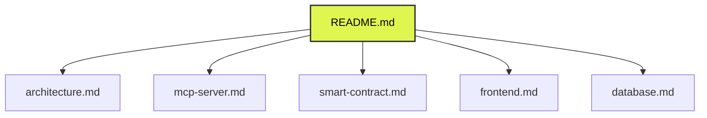

# StableSync MCP Documentation Portal

Welcome to the official documentation portal for **StableSync MCP** — an autonomous yield optimization agent and interactive dashboard built for the **Mantle Network**.

StableSync MCP is a state-of-the-art Web3 platform designed for hackathons, bridging the gap between decentralized finance (DeFi), institutional-grade risk models, and Large Language Model (LLM) agents via the **Model Context Protocol (MCP)**.

---

## 📂 Document Navigation

Select a document below to explore the technical details of the StableSync MCP implementation:

### [1. System Architecture (`docs/architecture.md`)](file:///home/lulipe/Documentos/StableSync_MCP/docs/architecture.md)
Comprehensive outline of the micro-architecture, describing the connection between the Vite React frontend, the Cloudflare Worker backend, the D1 SQLite Database, and the Mantle Sepolia smart contract.

### [2. Cloudflare Worker & MCP Server (`docs/mcp-server.md`)](file:///home/lulipe/Documentos/StableSync_MCP/docs/mcp-server.md)
Detailed specification of the Model Context Protocol (MCP) server running inside the Worker. Documents the 7 active MCP tools, their JSON schemas, parameters, caching strategy, the **6-factor Risk Assessment Model**, and the **Optimal Allocation Algorithm**.

### [3. Smart Contract (`docs/smart-contract.md`)](file:///home/lulipe/Documentos/StableSync_MCP/docs/smart-contract.md)
Technical details of the Solidity benchmark registry contract `StableSyncDecisionBenchmark.sol` deployed on the Mantle Sepolia Network, detailing variables, modifiers, external functions, events, and performance tracking.

### [4. Frontend Dashboard (`docs/frontend.md`)](file:///home/lulipe/Documentos/StableSync_MCP/docs/frontend.md)
Documentation of the Vite React user interface, details on the glassmorphism layout design system, the dynamic components (`YieldScanner`, `RiskPanel`, `NansenRadar`, `DecisionLedger`), the **EIP-1193 Mantle Sepolia wallet connection hook**, and the MCP integration modal.

### [5. D1 Database Schema (`docs/database.md`)](file:///home/lulipe/Documentos/StableSync_MCP/docs/database.md)
Database schema definition for the SQLite Cloudflare D1 instance. Focuses on the structural layout of logged decisions, historical yield metrics, and settlement details.

---

## 🛠️ Tech Stack at a Glance

* **Backend / MCP Server:** Cloudflare Workers, TypeScript, `@modelcontextprotocol/sdk`
* **Database & Cache:** Cloudflare D1 (SQLite), Cloudflare KV Namespace
* **Frontend:** Vite, React, TypeScript, Vanilla CSS (OKLCH, Glassmorphism)
* **Smart Contracts:** Solidity `^0.8.20`, Hardhat, Ethers, Mantle Sepolia Testnet (Chain ID 5003)
* **DeFi Integrations:** DefiLlama Yields API, FRED (Federal Reserve Economic Data) API, Nansen Smart Money API
