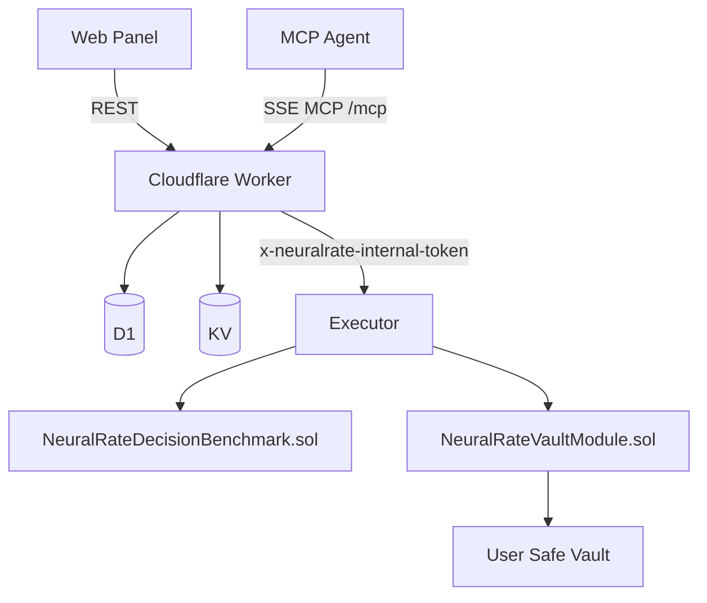

# System Architecture

**Status:** Canonical doc

This document describes the architecture implemented in the repository as of the current codebase state.

## Topology

NeuralRate has three runtime services plus on-chain contracts:

1. `apps/worker`
   Public surface for REST and MCP.
2. `apps/executor`
   Internal dispatch service for benchmark and strategy jobs.
3. `apps/web`
   User and operator panel.
4. Mantle Sepolia contracts
   Benchmark registry, Safe vault module, and preserved USDY adapter.

## Public vs Internal Boundaries

- **Public**
  - worker REST endpoints under `/api/*`
  - worker MCP endpoint at `/mcp`
  - web frontend
- **Internal**
  - executor HTTP API
  - worker-to-executor token-authenticated calls

The browser should not call the executor directly.

## Responsibility Split

### Worker

The worker is the control plane.

- serves market data endpoints and deterministic analytics
- stores user state in D1
- caches provider responses in KV
- verifies wallet-signed auth nonces for state-changing owner actions
- issues automation grants and short-lived MCP mutation sessions
- validates domain-scoped session usage
- forwards benchmark and execution jobs to the executor

### Executor

The executor is the dispatch layer.

- requires `x-neuralrate-internal-token`
- prepares benchmark and execution policies
- validates pinned strategy configuration
- checks the vault module deployment manifest and runtime bytecode
- submits benchmark transactions with the managed signer
- submits vault execution transactions through the Safe module
- reports job status back to the worker

### Web

The web app is not the control plane.

- connects the user wallet on Mantle Sepolia
- bootstraps user and vault state through the worker
- gathers nonce signatures and grant signatures
- shows settings, vault state, grants, sessions, jobs, and benchmark history
- queues benchmark and execution actions through the worker

## Main Flows

### 1. Analytics Flow

1. Web or agent calls the worker.
2. Worker reads cache or fetches from upstream providers.
3. Worker computes deterministic scoring and allocation output.
4. Worker returns structured JSON.

External provider usage in code:

- DefiLlama yields
- FRED Treasury data
- Nansen smart money data when configured

### 2. Owner-Signed Mutation Flow

For mutations without an MCP session token:

1. Client requests `/api/auth/nonce`.
2. Owner wallet signs the nonce envelope.
3. Worker verifies signature and nonce freshness.
4. Worker executes the requested mutation.

This is used by the web app and can also be used by MCP mutation tools when no `sessionToken` is supplied.

### 3. Grant and MCP Session Flow

1. Owner signs the canonical automation grant message.
2. Worker verifies the signature against the owner EOA.
3. Worker stores an `automation_grant`.
4. Worker creates a short-lived `mcp_mutation_session`.
5. Worker returns a `sessionToken`.
6. Mutation tools accept that `sessionToken` and resolve access from the stored session instead of trusting arbitrary `ownerEoa` input.

This grant/session flow is separate from the vault automation consent stored in `automation_sessions`.

Allowed grant domains in code:

- `state`
- `config`
- `benchmark`
- `execution`

### 4. Manual Enable-Automation Flow in the Web App

When the user enables automation from the web panel, the current code performs additional steps beyond the MCP grant:

1. The web app resolves or deploys the user Safe if needed.
2. The web app enables `NeuralRateVaultModule` on that Safe.
3. The web app builds a separate `NeuralRate Vault Automation Consent` message.
4. The owner signs that consent message.
5. The resulting consent payload is stored in `automation_sessions`.

### 5. Benchmark Flow

1. A decision is logged in D1.
2. The worker queues a benchmark job.
3. The executor submits `createDecision` on `NeuralRateDecisionBenchmark.sol`.
4. The executor confirms the transaction and parses `DecisionCreated`.
5. The worker persists `tx_hash`, `onchain_decision_id`, and job status.

### 6. Strategy Execution Flow

1. The worker validates access and policy scope.
2. The worker forwards a strategy job to the executor.
3. The executor resolves the strategy plan from the registry.
4. The executor validates target contract, selector, config, and pinned deployment metadata.
5. The executor calls `NeuralRateVaultModule`.
6. The module executes the real Safe call with `execTransactionFromModule`.

## Strategy State on Mantle Sepolia

- `mnt-native-transfer`
  - live default demo
  - real native `MNT` transfer
  - executed through the Safe module
- `usdy-stable-allocation`
  - preserved in the executor registry
  - not the default path
  - blocked when no canonical Sepolia venue is configured

The code intentionally fails closed instead of simulating a USDY venue on Sepolia.

## Persistence and Cache

### D1

The worker stores:

- decisions
- user profiles and configs
- vaults and permissions
- automation policies and sessions
- automation jobs and benchmark jobs
- auth nonces
- automation grants
- MCP mutation sessions

See [database.md](database.md) for the current schema.

### KV

Current TTL behavior implemented in code:

- DefiLlama yields: `300s`
- FRED T-Bill data: `3600s`
- Nansen positive cache: soft `600s`, hard `1800s`
- Nansen negative cache: `300s`

## Trust Boundaries

- The benchmark registry is global and separate from user vault funds.
- The user vault is isolated per owner.
- Automation authority is represented by a signed grant plus a short-lived mutation session.
- The executor is not the source of user authorization; the worker is.
- The Safe module address is pinned and verified before execution.
