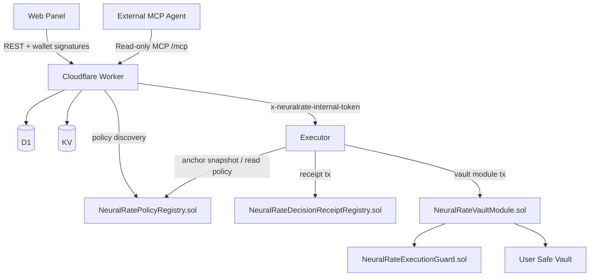

# System Architecture

**Status:** Canonical doc

This document describes the architecture implemented in the repository after the on-chain policy and receipt refactor.

## Topology

NeuralRate has three runtime services plus on-chain contracts:

1. `apps/worker`
   Public REST surface plus MCP catalogs.
2. `apps/executor`
   Internal dispatch service for receipt and strategy jobs.
3. `apps/web`
   User and operator panel.
4. Mantle Sepolia contracts
   Policy registry, execution guard, receipt registry, Safe vault module, and preserved USDY adapter.

## Public vs Internal Boundaries

- **Public**
  - worker REST endpoints under `/api/*`
  - worker read-only MCP endpoint at `/mcp`
  - worker scoped MCP catalogs at `/mcp/scoped/config`, `/mcp/scoped/benchmark`, and `/mcp/scoped/execution`
  - web frontend
- **Internal**
  - executor HTTP API
  - worker-to-executor token-authenticated calls

The browser should not call the executor directly.

## Responsibility Split

### Worker

The worker is now mostly a control plane and indexing layer.

- serves market data endpoints and deterministic analytics
- stores user state and historical metadata in D1
- caches provider responses in KV
- verifies wallet-signed auth nonces for owner actions
- issues grant/session records for MCP scoping
- exposes read-only MCP publicly
- exposes scoped mutation catalogs only when a valid `sessionToken` is presented at the route level
- overlays on-chain policy state into `AutomationState`
- forwards benchmark and execution jobs to the executor

### Executor

The executor is the dispatch layer.

- requires `x-neuralrate-internal-token`
- resolves the active on-chain policy before execution
- anchors `snapshotHash` and `snapshotCid` in the policy registry when needed
- validates pinned strategy configuration
- builds receipt-registry writes for decisions
- submits vault execution transactions through the Safe module path
- reports job status back to the worker

### Web

The web app remains the owner-operated panel.

- connects the user wallet on Mantle Sepolia
- bootstraps user and vault state through the worker
- gathers nonce signatures and grant signatures
- publishes the active policy on-chain when settings change
- revokes the active policy on-chain when automation is disabled
- shows settings, vault state, grants, sessions, jobs, and benchmark history
- queues benchmark and execution actions through the worker

## Main Flows

### 1. Analytics Flow

1. Web or agent calls the worker.
2. Worker reads cache or fetches from upstream providers.
3. Worker computes deterministic scoring and allocation output.
4. Worker returns structured JSON.

### 2. Owner-Signed Mutation Flow

For direct owner mutations:

1. Client requests `/api/auth/nonce`.
2. Owner wallet signs the nonce envelope.
3. Worker verifies signature and nonce freshness.
4. Worker executes the requested mutation or policy update.
5. The web app can then mirror the resulting limits to the on-chain policy registry.

### 3. Scoped MCP Catalog Flow

1. Owner signs a canonical automation grant.
2. Worker stores the grant and a short-lived `sessionToken`.
3. A scoped MCP route is requested with that `sessionToken`.
4. The worker verifies the route domain against the session before serving the MCP catalog.
5. Only the matching mutation tool is advertised on that scoped route.

This means catalog exposure is reduced before the model sees the tool list.

### 4. Policy Publication Flow

1. The web app saves the user policy through the worker for indexed state.
2. The web app publishes the same active policy directly on-chain through `NeuralRatePolicyRegistry`.
3. The policy records delegate, caps, allowlists, validity windows, and snapshot requirements.

### 5. Decision Receipt Flow

1. A decision is logged locally in D1.
2. The worker queues a benchmark-style receipt job.
3. The executor resolves the active on-chain policy.
4. The executor anchors the referenced snapshot if needed.
5. The executor submits `createDecisionReceipt` on `NeuralRateDecisionReceiptRegistry.sol`.
6. The worker persists `tx_hash`, on-chain receipt metadata, and job status.

### 6. Strategy Execution Flow

1. The worker validates scoped access and queues a strategy job.
2. The executor resolves the active on-chain policy.
3. The executor anchors the referenced snapshot if needed.
4. The executor builds an intent with snapshot hash, slippage, deadline, and policy version.
5. `NeuralRateExecutionGuard` validates the execution when the module call is made.
6. The module executes the real Safe call with `execTransactionFromModule`.

## Persistence and Cache

### D1

The worker still stores:

- decisions
- user profiles and configs
- vaults and permissions
- automation policies and sessions
- automation jobs and benchmark jobs
- auth nonces
- automation grants
- MCP session records

### KV

Current TTL behavior implemented in code:

- DefiLlama yields: `300s`
- FRED T-Bill data: `3600s`
- Nansen positive cache: soft `600s`, hard `1800s`
- Nansen negative cache: `300s`

## Trust Boundaries

- Execution authority is intended to come from on-chain policy plus guard validation, not from the worker alone.
- The worker still scopes MCP discovery and stores index state, but it is no longer the only meaningful execution gate.
- The executor is internal, but it must still satisfy the on-chain policy and snapshot path.
- The Safe module address is pinned and verified before execution.
