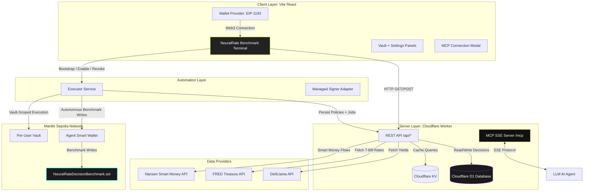

# System Architecture

NeuralRate MCP is built using a modern, decentralized micro-architecture designed for maximum speed, security, and developer interoperability. It bridges raw blockchain opportunities, traditional macroeconomic indicators, and institutional flow data into a unified, agent-driven interface.

---

## 🏗️ Structural Overview

The platform consists of five primary layers:
1. **Frontend Benchmark Terminal:** A Vite React Single Page Application (SPA) leveraging premium glassmorphism aesthetics, EIP-1193 wallet integration, per-user vault bootstrap, explicit wallet-ownership handoff, and personalized agent controls.
2. **Backend & MCP Server:** A unified Cloudflare Worker acting as both a REST API for the frontend and a Model Context Protocol (MCP) Server for AI agents over Server-Sent Events (SSE).
3. **Database & Cache Layer:** Cloudflare D1 (SQLite) for persistent decision, user, vault, policy, and job records; Cloudflare KV for indexing caching metrics.
4. **Executor Service:** A dedicated automation runtime that prepares vault-scoped permissions, tracks activation / revocation, and manages autonomous benchmark and execution jobs.
5. **On-Chain Benchmark Contract (Mantle Network):** A Solidity benchmark contract that acts as an immutable ledger for explicitly confirmed benchmark decisions and is prepared for a configurable agent smart wallet benchmark writer.

---

## 🔌 API & Integration Protocol

To achieve a clean separation of concerns:
* **The Frontend** communicates with the Backend via standard JSON over HTTP REST endpoints (`/api/*`).
* **AI Agents** communicate with the Backend using the **Model Context Protocol (MCP) over Server-Sent Events (SSE)** at `/mcp`. Under the hood, a Cloudflare Durable Object (`NeuralRateMcpAgent`) manages stateful SSE channels.
* **Automation** is orchestrated by the dedicated executor service rather than the Cloudflare Worker. Users sign consent from the frontend, while the executor manages vault-scoped session state and job queues.
* **Ownership handoff** is tracked in D1 per vault, so funding and automation remain gated until the user acknowledges the distinction between the Safe vault and the controlling wallet.
* **Recommendations** consume global market data but resolve user-specific policy, presets, and limits from D1 before ranking pools.
* **Smart Contracts** are targeted on the **Mantle Sepolia Testnet** (Chain ID `5003`). The benchmark contract remains global, while user execution is always isolated to a dedicated vault per user.

---

## 🗄️ Caching and Resilience Strategy

To remain highly responsive during hackathon presentations and avoid third-party API rate-limits:
1. **DefiLlama Service:** Cached in Cloudflare KV for **5 minutes** (300 seconds). If cache misses, the worker fetches all yields from `https://yields.llama.fi/pools`, filters for Mantle pools, and stores them back in KV.
2. **FRED macroeconomic data:** Cached in Cloudflare KV for **1 hour** (3600 seconds) since Treasury Bill interest rates fluctuate slowly. Falls back dynamically across the 5 most recent observations if holidays return null values.
3. **Nansen Flow Signal:** Cached in Cloudflare KV for **10 minutes** (600 seconds). Gracefully disables smart money signals and returns structured fallbacks if API keys are not configured.
