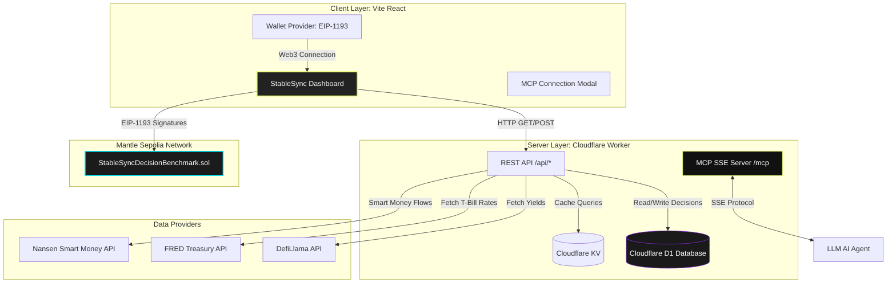

# System Architecture

StableSync MCP is built using a modern, decentralized micro-architecture designed for maximum speed, security, and developer interoperability. It bridges raw blockchain opportunities, traditional macroeconomic indicators, and institutional flow data into a unified, agent-driven interface.

---

## 🏗️ Structural Overview

The platform consists of four primary layers:
1. **Frontend Dashboard:** A Vite React Single Page Application (SPA) leveraging premium glassmorphism aesthetics and EIP-1193 wallet integration.
2. **Backend & MCP Server:** A unified Cloudflare Worker acting as both a REST API for the frontend and a Model Context Protocol (MCP) Server for AI agents over Server-Sent Events (SSE).
3. **Database & Cache Layer:** Cloudflare D1 (SQLite) for persistent decision records and Cloudflare KV for indexing caching metrics.
4. **On-Chain Registry (Mantle Network):** A Solidity benchmark contract that acts as an immutable ledger for AI decisions.

---

## 🔌 API & Integration Protocol

To achieve a clean separation of concerns:
* **The Frontend** communicates with the Backend via standard JSON over HTTP REST endpoints (`/api/*`).
* **AI Agents** communicate with the Backend using the **Model Context Protocol (MCP) over Server-Sent Events (SSE)** at `/mcp`. Under the hood, a Cloudflare Durable Object (`StableSyncMcpAgent`) manages stateful SSE channels.
* **Smart Contracts** are triggered directly from the frontend using the user's connected Web3 wallet (MetaMask, Rabby, etc.) targeting the **Mantle Sepolia Testnet** (Chain ID `5003`).

---

## 🗄️ Caching and Resilience Strategy

To remain highly responsive during hackathon presentations and avoid third-party API rate-limits:
1. **DefiLlama Service:** Cached in Cloudflare KV for **5 minutes** (300 seconds). If cache misses, the worker fetches all yields from `https://yields.llama.fi/pools`, filters for Mantle pools, and stores them back in KV.
2. **FRED macroeconomic data:** Cached in Cloudflare KV for **1 hour** (3600 seconds) since Treasury Bill interest rates fluctuate slowly. Falls back dynamically across the 5 most recent observations if holidays return null values.
3. **Nansen Flow Signal:** Cached in Cloudflare KV for **10 minutes** (600 seconds). Gracefully disables smart money signals and returns structured fallbacks if API keys are not configured.
